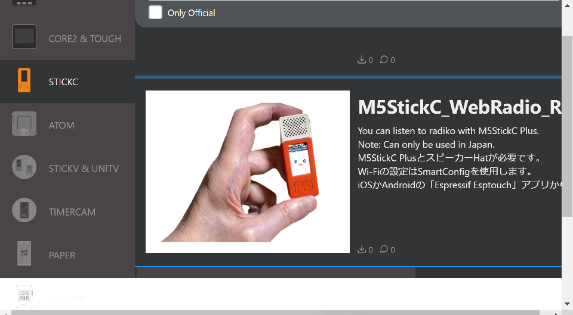

# M5StickC_WebRadio_Radiko_Avatar
M5StickC Plus用アバター表示、レベルメーター付きRadikoプレイヤー

  

wakwak-kobaさんの M5Stack Radikoプレイヤーをアバターとレベルメーターを同時に表示できるように改造。 
さらにM5StickC Plusで動くようにしました。 

Radikoプレイヤーは、wakwak-kobaさんのWebRadio_Japanをベースにさせていただきました。 
オリジナルはこちら。 
WebRadio_Japan <https://github.com/wakwak-koba/WebRadio_Japan> 

Avatar表示は、meganetaaanさんのm5stack-avatarをベースにさせていただきました。 
オリジナルはこちら。 
An M5Stack library for rendering avatar faces <https://github.com/meganetaaan/m5stack-avator> 

---
### このプログラムを動かすのに必要な物 ###
* M5StickC Plus
* [スピーカーHat](https://www.switch-science.com/catalog/5754/ "Title")
* VSCode
* PlatformIO 

使用しているライブラリ等は"platformio.ini"を参照してください。 

---
### WiFiの設定 ###
* "M5StickC_WebRadio_Radiko_Avatar.ino"の1行目付近、SSIDとPASSWORDを設定してください。
* SSIDとPASSWORDを設定せずにSmartConfigを使用することもできます。
その場合はiOSかAndroidの「Espressif Esptouch」アプリから設定します。

---
ビルド済みファームウェアをM5Burner v3に公開しました。すぐに使ってみたい方はこちらをどうぞ。 

   

### 使い方 ###
* M5StickC PlusとスピーカーHatが必要です。 
* Wi-Fiの設定はSmartConfigを使用、iOSかAndroidの「Espressif Esptouch」アプリから設定します。 
* ボタンA：選曲 ボタンA長押し：音量＋ ボタンB：音量  

